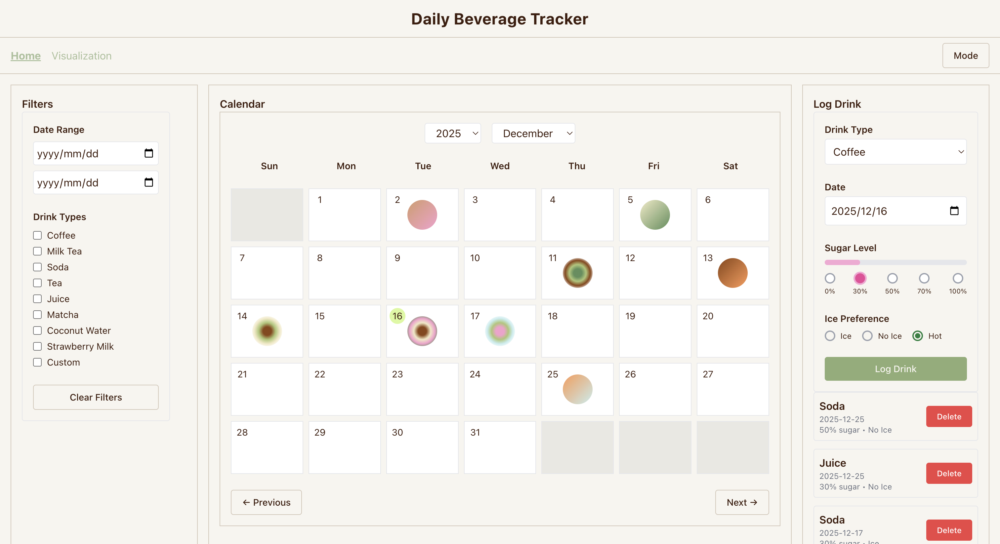
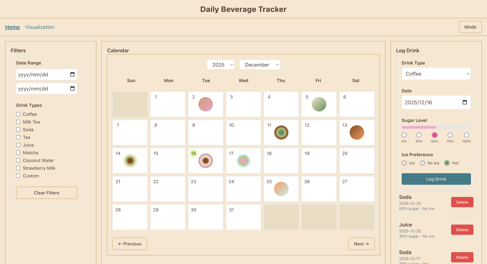
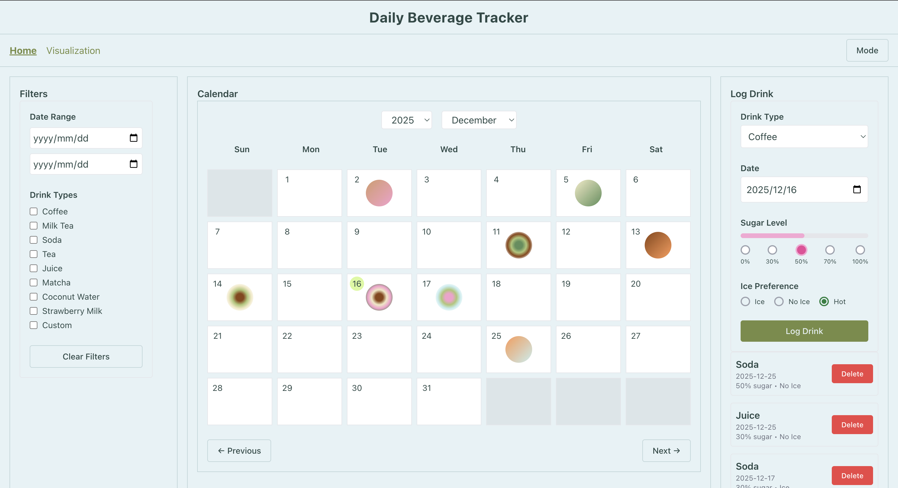
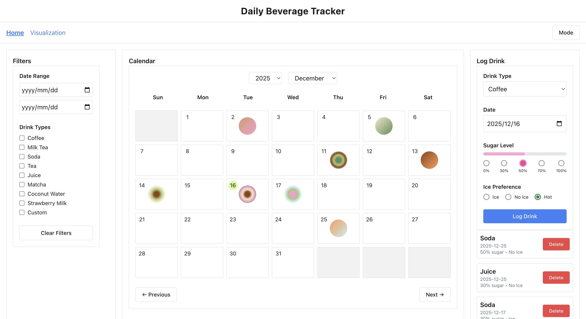
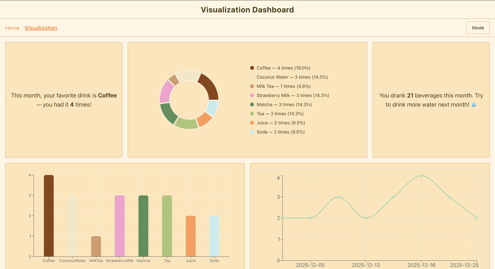
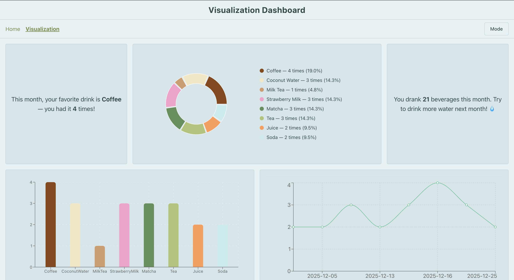

# Daily Beverage Tracker 🍵

A React web app for tracking daily beverage intake through a calendar-style log and simple data visualizations.  

The design theme centers on health awareness and data visualization, drawing inspiration from mood-tracking apps to create an engaging interface.

It helps users understand:

- The frequency of consumption for different beverages

- Weekly or monthly favorite drinks

- And trends in daily beverage diversity over time

## Inspiration

This project was inspired by my own daily habit of drinking different beverages (coffee, tea, milk drinks, etc.) and the difficulty of remembering what I actually consumed over time.  
I wanted to design a tool that feels closer to a personal journal than a strict health tracker, using a calendar view and subtle visual cues instead of numbers-heavy input.

## Presentation Slide

You can view the project presentation here:  
👉 **[Presentation Slide](https://docs.google.com/presentation/d/1iuRQUIPR31pkYAglHcHv17f7_I-zGaROzRwa6NeYsgk/edit?usp=sharing)**

## How does it looks 👀

  
	 
  ⬆️ MainPage

  
  
	
	 
  ⬆️ You can toggle different color themes

  
	
	 
  ⬆️ VisualizationPage

## Tech Stack 🔧

- **React** – used to build a component-based interface with hooks such as `useState`, `useEffect`, and `useRef`
- **Redux Toolkit + React Redux** – managing global application state including beverage logs, filters, and color themes
- **Redux Persist** – ensuring logged data and selected themes persist after page refresh
- **React Router** – handling navigation between the calendar view and visualization view
- **Recharts** – creating bar and line charts to visualize beverage consumption patterns
- **Tailwind CSS** – styling the interface and supporting multiple visual themes

## Updates After Presentation ✨

After the presentation, I continued refining the project with several UI and interaction improvements:

- Modified current date indicator:

	- Fixed an issue where the current-date indicator overlapped with two-digit date numbers in the calendar

	- Added a visual highlight for the currently selected theme to reduce confusion

	- Changed the current-date highlight color from red to a softer light lime green to reduce visual distraction

- Fixed a bug where the selected color theme was not persisted across refreshes

- Refined color themes:

	- Ajusted color themes to feel more comfortable and cozy overall while remain readability

	- Slightly adjusted drink colors and mappings for better visual balance

- Fixed an issue where charts displayed decimal values to only show integers

- Added a custom favicon

- Updated non-current-month calendar cells to use a translucent black instead of gray, making them compatible with all color themes

